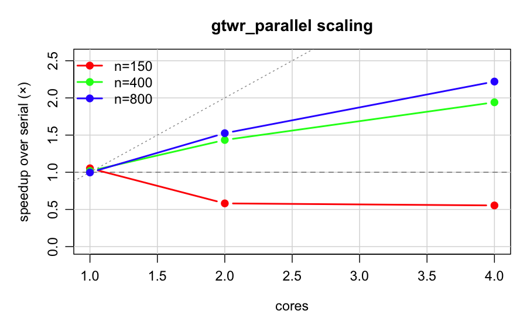

# gtwr_parallel benchmark

R 4.6.1 on Darwin 24.6.0 (arm64)
Cores detected (physical): 12
Cluster type: fork

Serial baseline is `gtwr()` (still with the vectorized `st.dist`).

| n | cores | serial (s) | parallel (s) | speedup | reps |
|---:|---:|---:|---:|---:|---:|
| 150 | 1 | 0.014 | 0.013 | 1.05× | 3 |
| 150 | 2 | 0.014 | 0.023 | 0.58× | 3 |
| 150 | 4 | 0.014 | 0.025 | 0.55× | 3 |
| 400 | 1 | 0.219 | 0.216 | 1.02× | 3 |
| 400 | 2 | 0.219 | 0.153 | 1.43× | 3 |
| 400 | 4 | 0.219 | 0.113 | 1.94× | 3 |
| 800 | 1 | 1.783 | 1.788 | 1.00× | 2 |
| 800 | 2 | 1.783 | 1.169 | 1.53× | 2 |
| 800 | 4 | 1.783 | 0.803 | 2.22× | 2 |

Parity: `tests/test_gtwr_parallel.R` asserts `betas`, `RSS`, `AICc`, and full `SDF@data` match serial at cores ∈ {2, 4} to 1e-8 tolerance.

Interpretation:
- n=150: parallel *loses* — fork + result serialization overhead dominates a per-point workload that's already sub-millisecond.
- n=400: ~1.9× at 4 cores. Solid win.
- n=800: ~2.2× at 4 cores; per-point work is heavier so overhead is amortized better.

The dropoff below linear reflects (a) fork/serialization overhead, (b) memory-bandwidth contention as workers all touch the same shared `st.dMat`, and (c) `mclapply`'s pre-scheduling chunking. For n < ~300 leave `cores = 1`; for n ≥ 500 use `cores = physical_cores / 2` as a starting point.
